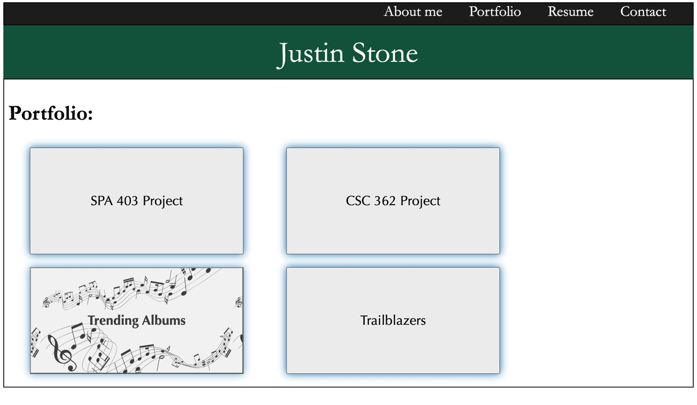

# react_portfolio

## Table of Contents 
1. [Description](#description)
2.  [Visuals](#visuals)
3. [Resources](#resources)

## Author:

Justin Stone

## Description

This page contains an example portfolio that can toggle between an about me page, a contact page, a resume page and a portfolio page. This app is created with react and deployed live with Heroku. The app uses css to style the elements created in react.

## Visuals

## Resources
[LIVE SITE](https://justinstone2001.github.io/Code-Quiz/)

[Repository](https://github.com/Justinstone2001/react_portfolio)